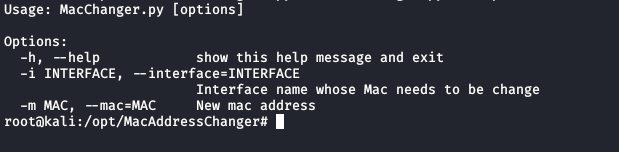
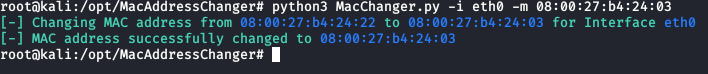

# MacAddressChanger

**MacChanger** is a python tool designed to change the MAC Address of the Linux System

## Install

**Prerequisites**

- Python 3.7.6

**Installing**

  $ git clone https://github.com/amananand369/MacAddressChanger.git
  
  $ cd MacAddressChanger
  
  $ python3 MacChanger.py -i <interface_name> -m <new_mac>
  
 MacChanger arguments
-----

  $ python3 MacChanger.py --help 
  
  
  
  Example
-------

**Change Mac Address**

 $ python3 MacChanger.py -i eth0 -m xx:xx:xx:xx:xx:xx 
  
 
  
  
  
